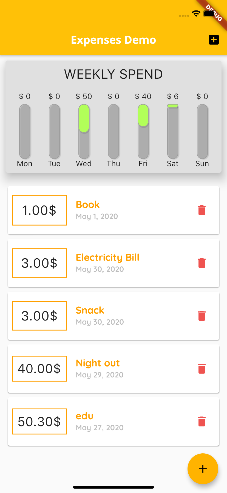
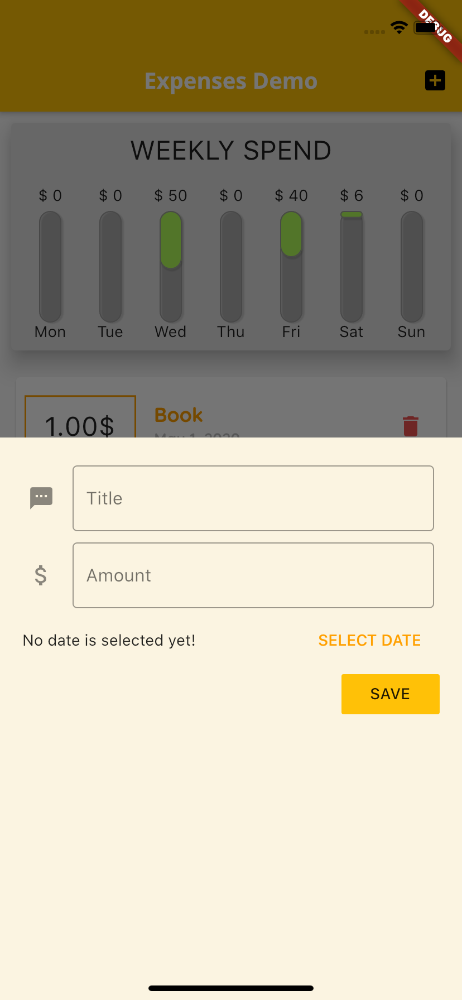

# code-flutter

# 🎨 Layout and Design

## layout_demo [Basic Layout Learning]

layout_demo project is tutorial work of layout. In the project, build the layout for the following:

<div>

 
</div>

## 🧩ui_building

In this project, tried out following widgets.

- buttons
- pull down
- radio
- checkbox
- input
- alert box
- app bar
- Your Wallet Design (inspired from google search result, hope they won't mind for using their design)

```
dependencies:
  backdrop: ^0.2.8
  widget_with_codeview: ^1.0.3
```

<div>
 
</div>

# 🤹🏻‍♂️ State Management

- provider

## pl_players

This is simple flutter project.
Used ChangeNotifierProvider for state management.

```
dependencies:
  provider: ^4.0.2
```

<div>
 
</div>

# 🗄 Database

## Local DB

- sqflite
- moor

## book_moor

Used Moor as persistence library.
Simple CRUD operation done on Category Model.

```
dependencies:
  moor_flutter: ^2.0.0
```

<div>
 
</div>

# 💭 Demo

## expenses_demo

Weekly spend tracking demo with in memory data storage.

<div>
 
 
 
</div>
