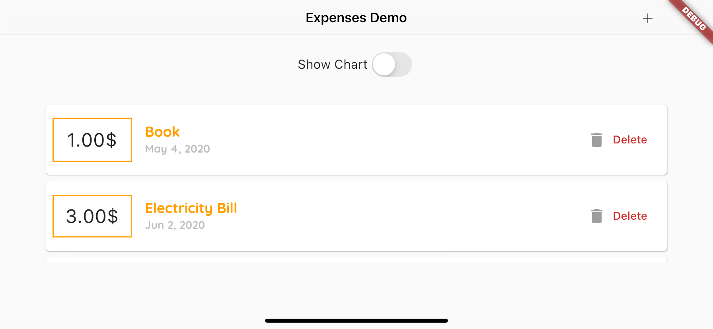

# expenses_demo

Weekly expense tracking demo project.

- Responsive (MediaQuery, LayoutBuilder) apply
- Landscape / Portrait mode control
- Device platform control

## UI

> Android Look

 
 

> IOS Look

 

> Landscape

 
 

---

TODO

1. [ ] State management with provider
2. [ ] Local db
3. [ ] Update ?
4. [ ] Monthly usage pie chart
